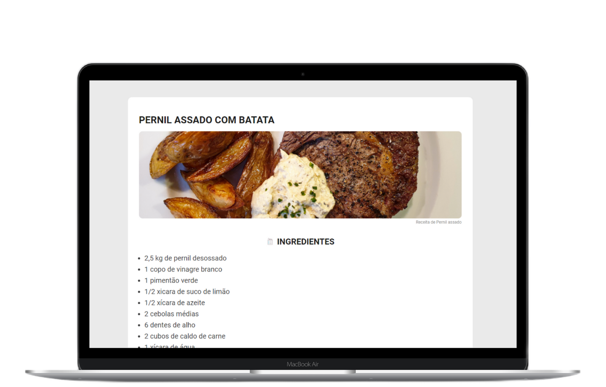

<h1 align="center" justify="center">Página de Receita</h1>

  <a href="#-tecnologias">Tecnologias</a>&nbsp;&nbsp;&nbsp;|&nbsp;&nbsp;&nbsp;
  <a href="#-projeto">Projeto</a>&nbsp;&nbsp;&nbsp;|&nbsp;&nbsp;&nbsp;
  <a href="#-layout">Desafio</a>&nbsp;&nbsp;&nbsp;|&nbsp;&nbsp;&nbsp;
  <a href="#-licença">Licença</a>

  
  

  

## 🚀 Tecnologias

Esse projeto foi desenvolvido com as seguintes tecnologias:

- HTML
- CSS

## 💻 Projeto

Uma página de receita de pernil assado, desenvolvida como desafio do Discover.

## 🔖 Desafio

Você pode visualizar o desafio no [Discover](https://app.rocketseat.com.br/discover/challenges/cookbook). É necessário ter uma conta para acessá-lo.

O discover é uma formação completa para dominar os fundamentos da web. Saiba mais em [rocketseat.com.br](https://www.rocketseat.com.br/discover).

## 📄 Licença

Esse projeto está sob a licença MIT. <!--Veja o arquivo [LICENSE](LICENSE) para mais detalhes. -->

---

Feito com ❤ by Matheus 👋🏻
